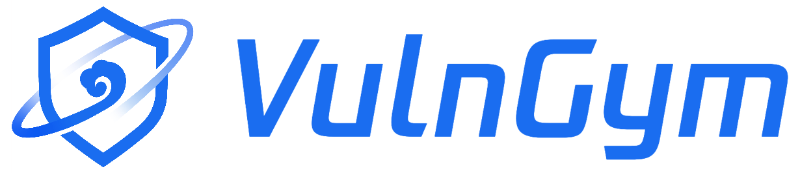

# VulnGym T2 · 漏洞条目提取工作台

这是一个在本机运行的 T2 工作台：结合公开漏洞公告、修复补丁和目标仓库源码，生成可复核的 VulnGym `entries.jsonl` 条目候选。提供网页界面和 CLI；证据不足的字段会保留待补充，不把模型猜测当成已核实事实。

本仓库是独立实现，**不是腾讯官方产品，也不代表腾讯认可其输出**。上方图标的来源与使用说明见[图标说明](vulngym_t2/web_assets/brand/README.md)。

[下载 Windows x64 交付包](https://github.com/Qiyuanqiii/VulnGym-T2/releases/tag/t2-submission-v12) · [解压启动说明](README_START.md) · [输出字段参考](SCHEMA.md) · [效果与缺口](docs/t2_representative_validation_20260913.md)

## 用它做什么

- 在网页中一次粘贴多条 GHSA 或 OSV 公告链接（每批最多 20 条），先获取公开资料并免费检查输入；也可以使用已有的本地公告、补丁和 Git 仓库。
- 确认自己的模型 key 与本批请求上限后，逐份读取证据并生成候选。准备资料、查看历史结果和检查输入不会调用模型；目标仓库代码不会被运行。
- 在工作台查看源码位置、依据和不确定项，再按需导出结果。

| 主要文件 | 含义 |
| --- | --- |
| `entries.jsonl` | 字段齐全的机器候选；`verify=0`，并非人工确认或标准答案。 |
| `drafts.jsonl` | 依据不足、字段待补充或未能完整成稿的记录。 |
| `review.jsonl` | 各字段的依据、疑点和复核说明。 |

其他报告与运行记录可从工作台的“更多文件”导出。完整字段定义见[数据格式参考](SCHEMA.md)。

## 五分钟上手

1. 从 [Release 下载 ZIP](https://github.com/Qiyuanqiii/VulnGym-T2/releases/download/t2-submission-v12/VulnGym-T2-Submission-Windows-x64-v12.zip)，**完整解压**到可写目录；不要在压缩软件中直接运行。
2. 只想看成品：双击 `start-demo.cmd`，无需 key、Git 或模型费用，可查看三个已保存的开发案例和演示视频。
3. 想自己提取：双击 `start.cmd`，在网页中点“添加资料并提取”。粘贴公告链接或切换为本地资料，先点“获取资料并检查”，再输入自己的模型 key、设置请求上限并确认开始。实际提取需要 Git；链接模式还需要访问所选公开公告来源和目标源码仓库。
4. 在结果页核对证据，再导出 `entries.jsonl`、草稿和复核报告。请对重要字段进行人工复核。

`start-direct.cmd` 可在本机具备直连条件时显式选择直连获取公开资料；遇到拒绝访问或限流时程序不会自动换来源、换出口或反复请求。具体操作、演示数据和网络模式见[解压启动说明](README_START.md)。请求次数限制不等于费用硬限额；建议同时在模型服务平台设置费用上限。

## 从源码运行

GitHub 仓库保存的是源码，**不包含 Release ZIP 内的便携 Python 运行时和演示视频**。克隆源码后，请准备 Python 3.13 和 Git，再在仓库根目录运行：

```text
python launch_workbench.py
python -m vulngym_t2 --help
```

第一条打开本地网页工作台，第二条查看 CLI 参数。Windows x64 免安装演示与交付验证以 Release ZIP 为准；其他系统的源码运行尚未作为本次便携交付验收范围。

## 结果边界

包内三个结果批次来自已见开发案例，不是盲测或总体准确率证明。`entries.jsonl` 的“完整”仅表示通过了当前结构和字段检查；`verify=0`，仍需人工判断入口、关键操作、调用链和漏洞版本是否正确。依据不足时保留草稿是预期行为。当前交付不包含 T1 自动反馈迭代。

v12 发布包已通过解压启动检查；包内离线测试运行 1287 项，1 项因环境条件跳过，其余通过。这说明交付与代码回归状态，不等于模型输出获得人工验收。版本差异、真实复测和已知缺口见[代表性验证](docs/t2_representative_validation_20260913.md)，开发过程记录见[工程说明](ENGINEERING_README.md)。

交付包不包含 API key、原请求账本、私有数据集或第三方目标仓库。完整文件清单及演示视频校验值在 ZIP 内的 `SUBMISSION.json`。
